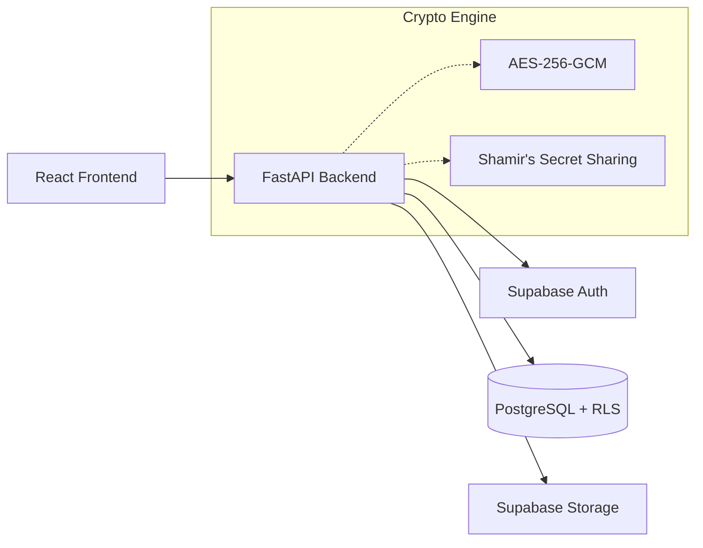

# Secure Cloud-Based Question Paper Management System


A cryptographically secure, cloud-native prototype designed to eliminate question paper leaks in government and competitive examinations. This system utilizes AES-256 encryption, Shamir's Secret Sharing, and zero-trust architecture to ensure no single entity can access the paper prematurely.

**Author:** Elamaran D  
**Version:** 1.0 (Hackathon Prototype)

---

## 🏛️ Architecture



## 🛠️ Tech Stack
*   **Frontend:** React, TailwindCSS, Vite
*   **Backend:** Python, FastAPI, Uvicorn
*   **Database:** PostgreSQL (Supabase)
*   **Authentication:** Supabase Auth (JWT)
*   **Cryptography:** PyCryptodome (AES, SSS), Hashlib (SHA-256)

## 🔐 Core Security Features
1.  **Distributed Key Custody:** Encryption keys are split using Shamir's Secret Sharing. Collusion is required to reconstruct the key.
2.  **Row Level Security (RLS):** Database-level access control guarantees users only see authorized data.
3.  **Immutable Audit Ledger:** Every action is logged; triggers prevent deletion or tampering.
4.  **Time-Locked Release:** Server-enforced clock prevents decryption until exactly T-30 minutes before the exam.
5.  **Dynamic Watermarking:** Decrypted PDFs are stamped with Centre IDs to trace any physical leaks.

---

## 🚀 Setup Instructions

### Prerequisites
*   Node.js (v18+)
*   Python 3.10+
*   A free Supabase Account

### Step 1: Clone Repository
```bash
git clone https://github.com/placeholder/secure-qp-system.git
cd secure-qp-system
```

### Step 2: Supabase Setup
1. Create a new project in [Supabase](https://supabase.com).
2. Go to the SQL Editor and run the provided schema:
   ```sql
   -- Copy contents from database/schema.sql and execute
   ```
3. Create a new Storage bucket named `encrypted_papers` and ensure it is set to **Private**.

### Step 3: Environment Variables
Create `.env` files in both backend and frontend directories.

**Backend (`backend/.env`):**
```env
SUPABASE_URL=your_project_url
SUPABASE_SERVICE_KEY=your_service_role_key
JWT_SECRET=your_jwt_secret
```

**Frontend (`frontend/.env`):**
```env
VITE_SUPABASE_URL=your_project_url
VITE_SUPABASE_ANON_KEY=your_anon_key
VITE_API_BASE_URL=http://localhost:8000
```

### Step 4: Start Backend
```bash
cd backend
pip install -r requirements.txt
uvicorn main:app --reload
```

### Step 5: Start Frontend
```bash
cd frontend
npm install
npm run dev
```

---

## 👥 User Roles
*   **Setter:** Creates and submits individual questions.
*   **Reviewer:** Moderates and approves questions for the pool.
*   **Compiler (Chief Examiner):** Compiles approved questions into a final paper and triggers encryption.
*   **Key Holder:** Holds a piece of the decryption key. Must approve release on exam day.
*   **Centre Coordinator:** Downloads and decrypts the paper at the exam centre.

## 🖼️ Screenshots
*(Placeholder for UI screenshots)*

## 📄 License
This project is licensed under the MIT License - see the LICENSE file for details.
"# cloud-project" 
