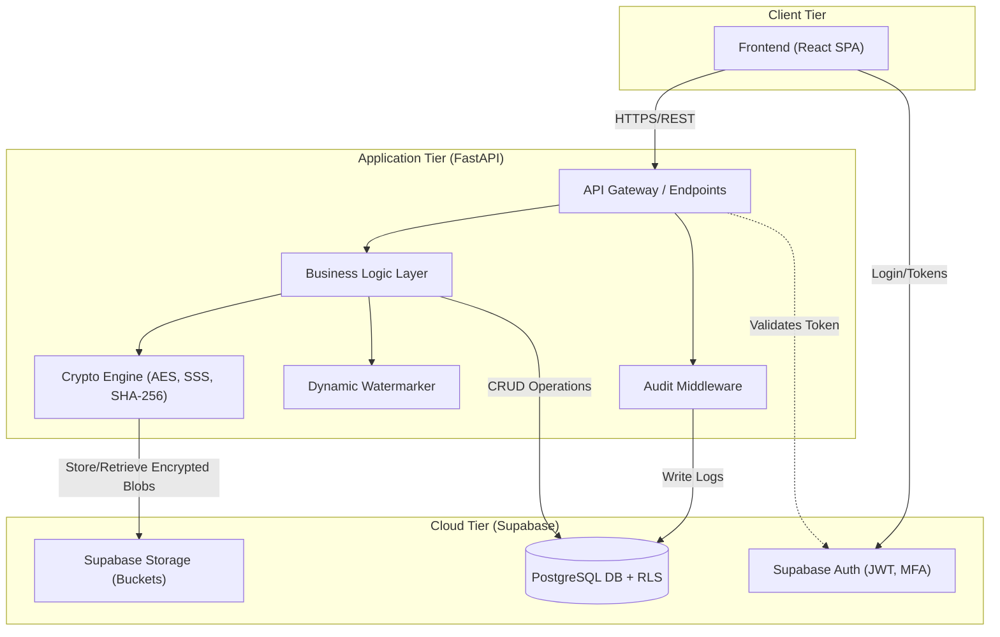

# Architecture

The system follows a modern, scalable, cloud-native architecture. 

## System Components

*   **Frontend (React):** A Single Page Application (SPA) providing the user interface for setters, reviewers, compilers, and exam centres.
*   **API Layer (FastAPI):** A high-performance Python backend handling business logic, encryption, and key generation.
*   **Auth (Supabase Auth):** Manages user registration, login, JWT issuance, and MFA.
*   **Database (PostgreSQL + RLS):** Stores relational data (questions, audit logs, metadata) with strict Row Level Security policies.
*   **Storage (Supabase Storage):** A secure object store for the encrypted PDF files.
*   **Crypto Engine:** A module within the FastAPI backend responsible for AES encryption, Shamir's Secret Sharing, and Hashing.
*   **Audit Layer:** A middleware component ensuring all critical API calls are logged to the database.

## Architecture Diagram

## Data Flow Description
1. The React app authenticates the user via Supabase Auth and receives a JWT.
2. The user makes requests to the FastAPI backend, including the JWT in the Authorization header.
3. FastAPI validates the token and processes the request through the Business Logic layer.
4. For sensitive actions, the Audit Middleware logs the request details to the PostgreSQL database.
5. When a paper is compiled, the Crypto Engine encrypts it and uploads the encrypted blob to Supabase Storage.
6. Database queries are executed against PostgreSQL, which enforces RLS based on the user's JWT claims, ensuring they only access authorized data.
