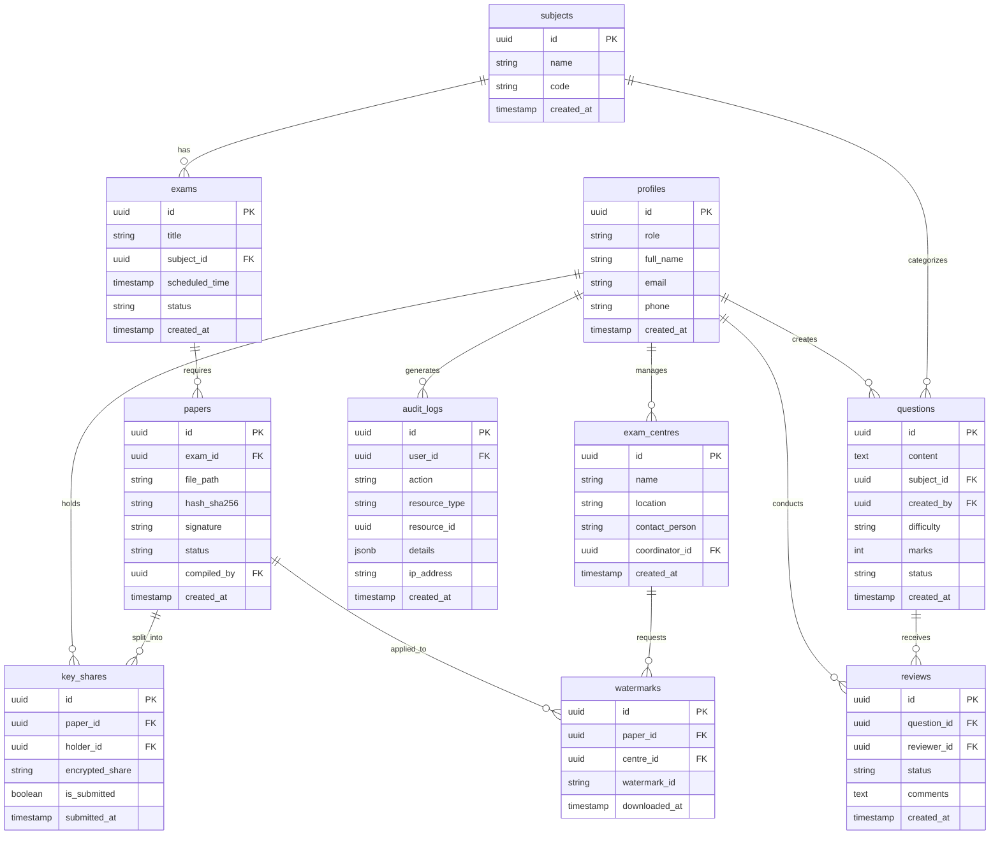

# Entity Relationship Diagram

The database schema is designed to enforce relational integrity and support Row Level Security (RLS). Below is the complete Entity Relationship (ER) diagram for the system.

