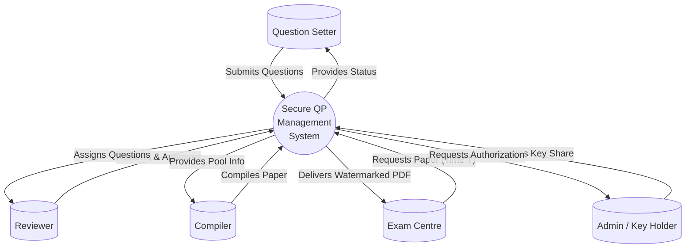
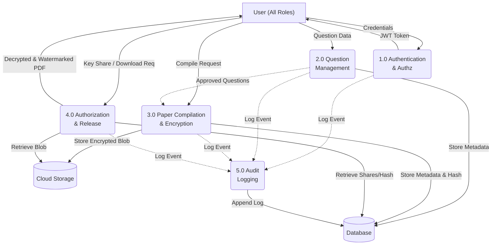
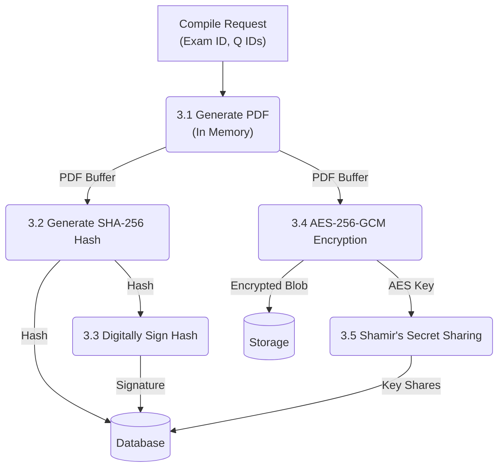

# Data Flow Diagrams (DFD)

## Level 0: Context Diagram
This diagram shows the system boundary and external entities interacting with the Question Paper Management System.

---

## Level 1: Major Processes
This diagram breaks down the main system into major operational processes.

---

## Level 2: Sub-processes for Compilation & Encryption
Detailing process 3.0 (Paper Compilation & Encryption).

