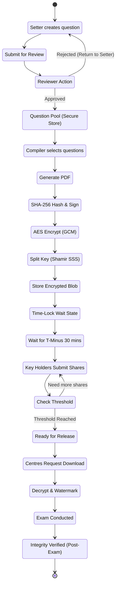

# Activity Diagram

This diagram outlines the complete lifecycle of a question paper from creation to final distribution at the exam centre.

```mermaid
stateDiagram-v2
    [*] --> QuestionCreation
    
    state "Setter creates question" as QuestionCreation
    state "Submit for Review" as SubmitReview
    
    QuestionCreation --> SubmitReview
    
    state "Reviewer Action" as ReviewAction
    SubmitReview --> ReviewAction
    
    ReviewAction --> QuestionCreation: Rejected (Return to Setter)
    ReviewAction --> QuestionPool: Approved
    
    state "Question Pool (Secure Store)" as QuestionPool
    
    state "Compiler selects questions" as Compilation
    QuestionPool --> Compilation
    
    state "Generate PDF" as GenPDF
    Compilation --> GenPDF
    
    state "SHA-256 Hash & Sign" as HashSign
    GenPDF --> HashSign
    
    state "AES Encrypt (GCM)" as Encrypt
    HashSign --> Encrypt
    
    state "Split Key (Shamir SSS)" as SplitKey
    Encrypt --> SplitKey
    
    state "Store Encrypted Blob" as StoreBlob
    SplitKey --> StoreBlob
    
    state "Time-Lock Wait State" as TimeLock
    StoreBlob --> TimeLock
    
    state "Wait for T-Minus 30 mins" as WaitTime
    TimeLock --> WaitTime
    
    state "Key Holders Submit Shares" as KeyAuth
    WaitTime --> KeyAuth
    
    state "Check Threshold" as ThresholdCheck
    KeyAuth --> ThresholdCheck
    
    ThresholdCheck --> KeyAuth: Need more shares
    ThresholdCheck --> ReleaseReady: Threshold Reached
    
    state "Ready for Release" as ReleaseReady
    
    state "Centres Request Download" as DownloadReq
    ReleaseReady --> DownloadReq
    
    state "Decrypt & Watermark" as DecryptWatermark
    DownloadReq --> DecryptWatermark
    
    state "Exam Conducted" as Conduct
    DecryptWatermark --> Conduct
    
    state "Integrity Verified (Post-Exam)" as Verify
    Conduct --> Verify
    
    Verify --> [*]
```
